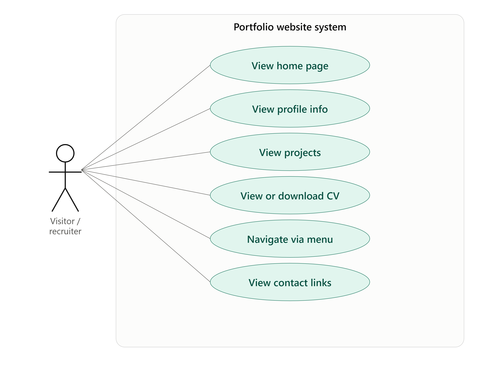
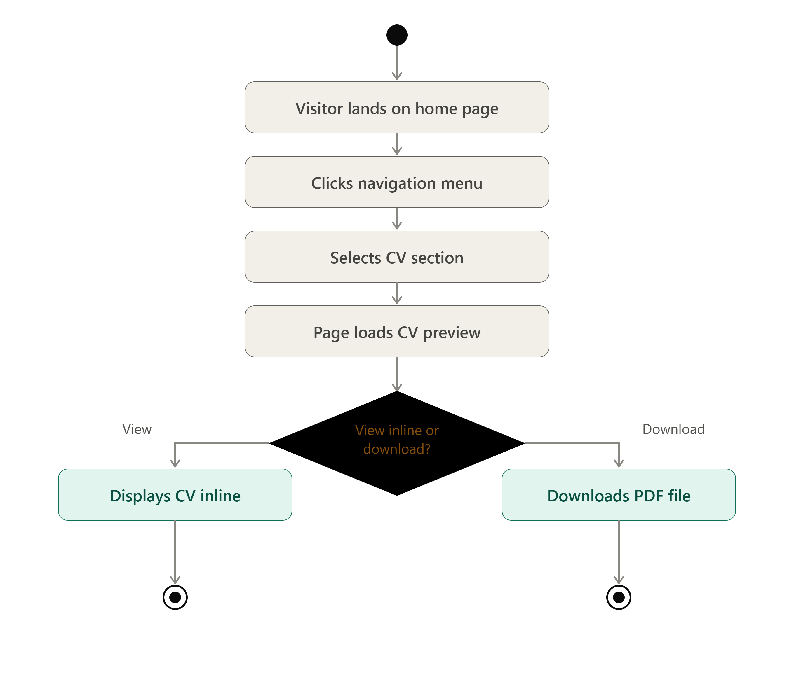
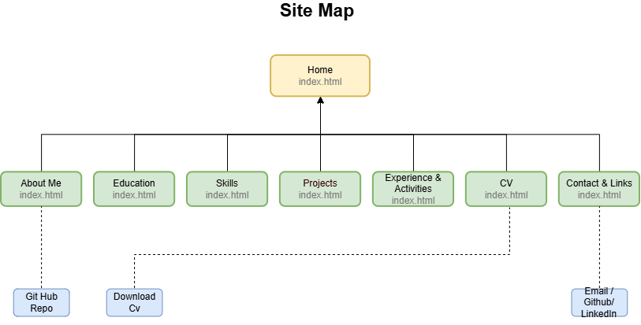
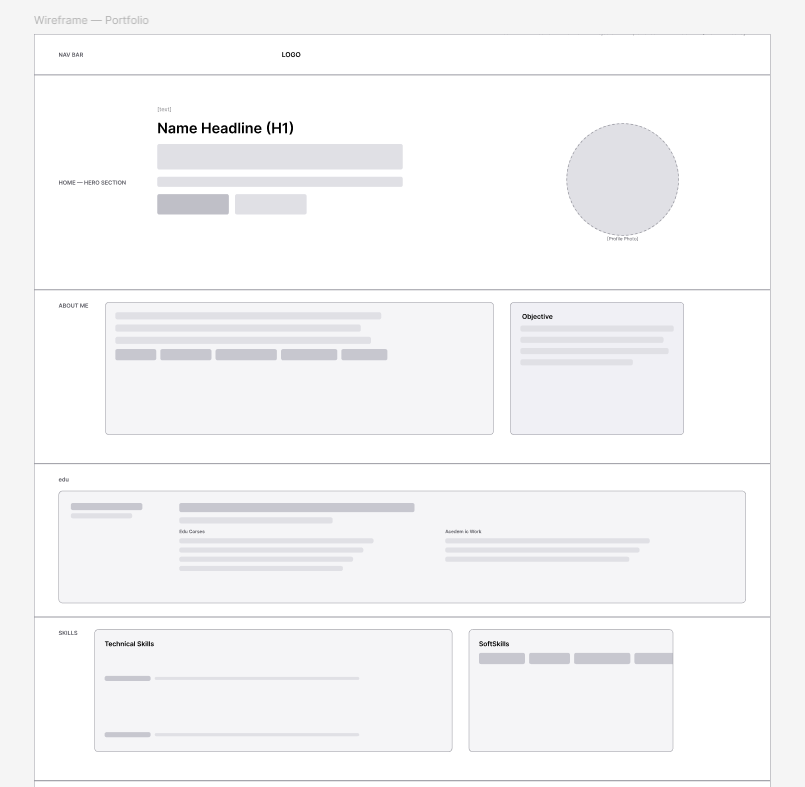

# theekshana.github.io

A personal portfolio website built as coursework for **System Analysis and Design (SAD)**, showcasing my education, skills, projects and experience for internship/employment applications.

**Live site:** _(coming soon — will be added after deployment)_
**Author:** [Theekshana Thathsara Mallawaarachchi] — [theekshanathathsara1.com]

---

## Project Status
🟡 **In Progress** — Planning & Analysis phase complete (Week 1, Day 1)

---

## 1. Problem Statement

I currently have no centralized, professional platform to present my skills, education and project work to potential employers. A traditional CV alone doesn't show practical, verifiable evidence of my abilities, and my work is scattered across different platforms with no single link to share.

## 2. Objectives

- Create a mobile-responsive personal portfolio website within the 3-week project timeline.
- Showcase at least 3 real projects with clear problem, contribution, tools used and links.
- Enable visitors to view or download my CV in under 2 clicks.
- Provide direct, working links to my LinkedIn and GitHub profiles.
- Deploy the site on a free, publicly accessible platform (GitHub Pages).

## 3. Stakeholders

| Stakeholder | Role |
|---|---|
| Me (Owner/Developer) | Builds, maintains and updates the portfolio |
| Employers / Recruiters | Primary users — view my profile to assess fit for roles |
| Academic Evaluators | Secondary users — assess the site against SAD coursework criteria |

## 4. Scope

**In scope:**
- Static, single-page portfolio (Home, About, Education, Skills, Projects, Experience, CV, Contact)
- Mobile-responsive design
- Downloadable CV in PDF format
- Links to LinkedIn, GitHub and email

**Out of scope:**
- Backend/database functionality
- User login or authentication
- Blog/CMS features
- Payment or e-commerce functionality

## 5. Constraints

- 2–3 week development timeline (coursework deadline)
- No backend allowed per assignment requirements
- Must be hosted on a free platform
- Must remain publicly accessible during evaluation

## 6. Requirements

### Functional Requirements
- FR1: The system shall display the user's name, title and introduction on the Home page.
- FR2: The system shall allow visitors to navigate to all sections via a menu.
- FR3: The system shall allow visitors to view or download the CV as a PDF.
- FR4: The system shall display at least 3 projects with problem, contribution, tools used and links.
- FR5: The system shall provide clickable links to LinkedIn and GitHub.
- FR6: The system shall display education, skills and experience information clearly.

### Non-Functional Requirements
- NFR1: The website shall load within 3 seconds on a standard broadband connection.
- NFR2: The website shall be responsive across mobile, tablet and desktop screen widths.
- NFR3: The website shall be accessible (readable font sizes, sufficient color contrast).
- NFR4: The website shall be hosted on a free, publicly accessible platform with high uptime.

## 7. Planned Tech Stack

- HTML5, CSS3, JavaScript
- Bootstrap (styling)
- GitHub Pages (deployment)

## 8. Roadmap

- [x] Week 1, Day 1: Problem statement, objectives, stakeholders, scope, constraints, requirements
- [ ] Week 1: Use-case diagram, activity diagram, site map, wireframes
- [ ] Week 2: Build and style the site
- [ ] Week 3: Test, deploy, finalize SAD report

---
## 9. Use-Case Diagram & Descriptions

**Actors:** Visitor/Recruiter (primary)

**Use cases modeled:** View Home Page, View Profile Info (About/Education/Skills), View Projects, View/Download CV, Navigate via Menu, View Contact Links.

### Brief Use-Case Descriptions

| Use Case | Description |
|---|---|
| **View Home Page** | The visitor lands on the site and sees the name, title and short introduction. *Precondition:* site is deployed. *Postcondition:* visitor understands who the portfolio belongs to. |
| **View Profile Info** | The visitor browses About, Education and Skills to learn the owner's background. *Precondition:* content is published. *Postcondition:* visitor has a clear picture of qualifications. |
| **View Projects** | The visitor reviews at least three projects with problem, contribution, tools and links. *Precondition:* projects are added with screenshots/links. *Postcondition:* visitor can judge practical ability. |
| **View/Download CV** | The visitor opens the CV section and can view it inline or download the PDF. *Precondition:* CV file is uploaded. *Postcondition:* CV is displayed or downloaded. |
| **Navigate via Menu** | The visitor uses the navigation bar to jump between sections at any time. *Precondition:* nav menu is present on every view. *Postcondition:* visitor reaches the intended section. |
| **View Contact Links** | The visitor finds a professional email and links to LinkedIn/GitHub. *Precondition:* links are valid. *Postcondition:* visitor can reach out or view external profiles. |

## 10. Activity Diagram — "Visitor Finds and Downloads CV"

Models the key flow of a recruiter locating and retrieving the CV:

**Start → Visitor lands on Home → Clicks navigation menu → Selects "CV" section → Page loads CV preview → Decision: "View inline or download?" → (View path: displays CV inline / Download path: downloads PDF file) → End**

This flow was chosen because retrieving the CV is the single most important action a recruiter takes on the site, making it the clearest candidate for activity modeling.

## 11. Roadmap (updated)

- [x] Week 1, Day 1: Problem statement, objectives, stakeholders, scope, constraints, requirements
- [x] Week 1, Day 4–5: Use-case diagram + descriptions, activity diagram
- [ ] Week 1, Day 6: Site map & wireframes
- [ ] Week 2: Build and style the site
- [ ] Week 3: Test, deploy, finalize SAD report

## 12. Site Map & Wireframes

Since the portfolio is built as a single-page site with anchor-based navigation, the site map below shows the structure as sections under one Home page rather than separate URLs.

### Site Map

### Wireframes / High-Fidelity Design

Full page design created and iterated in Figma, covering Hero, Education, Projects, Skills, Activities and Contact sections.

- **Figma file:** [Portfolio Design](https://www.figma.com/design/2VLEdwVC5jB3BD1y5zpfAK/Theekshana-Portfolio-%E2%80%94-UI-Design---Wireframes?node-id=1-2&t=G00SFYDofY2HdcVw-1)
- Color palette derived directly from the hero photo (teal-blue accent, RGB ≈ 25, 135, 182) and applied consistently across buttons, section underlines, icons and progress bars for visual cohesion.

### Design Decisions

- Single-page layout with anchor navigation was chosen over multi-page for simplicity and faster load times, appropriate for a portfolio of this scope.
- A consistent teal-blue accent color (matched to the hero photo) was applied site-wide to create a cohesive visual identity rather than disconnected section colors.
- Education is presented in two complementary formats — quick-reference cards near the top and a detailed timeline lower down — to balance scannability with depth.

## 13. Roadmap (updated)

- [x] Week 1, Day 1: Problem statement, objectives, stakeholders, scope, constraints, requirements
- [x] Week 1, Day 4–5: Use-case diagram + descriptions, activity diagram
- [x] Week 1, Day 6: Site map & wireframes (Figma high-fidelity design)
- [ ] Week 2: Build and style the site (HTML/CSS/JS)
- [ ] Week 3: Test, deploy, finalize SAD report

## 14. Implementation — Day 1: Design Tokens & Base Styles

Development began by scaffolding the single-page site and establishing a design-token
layer before any section markup, so every later section pulls from one consistent
source of truth for color, type and spacing.

**What was built:**
- Bare `index.html` skeleton (doctype, meta tags, title, empty body)
- CSS custom properties (`:root` tokens) for background, accent, and text colors
- Global reset, `::selection` styling, and visible keyboard focus states
- Type scale using Sora (display), Inter (body) and JetBrains Mono (labels/tags)
- Reusable utility classes: `.eyebrow`, `.section-title`, `.container`, `.section`

**Note on palette:** the current tokens use a violet/cyan/amber accent system rather
than the single teal-blue accent described in section 12's Design Decisions. This will
be reconciled before final submission — either the report text or the token values will
be updated so both agree.

**Requirements addressed:** groundwork for NFR3 (accessible font sizes, contrast, focus
visibility) — no functional requirements yet, as no sections exist to navigate.

**Commit:** `02e74cf` — *feat: base design tokens, reset and typography*

## 15. Roadmap (updated)

- [x] Week 1, Day 1: Problem statement, objectives, stakeholders, scope, constraints, requirements
- [x] Week 1, Day 4–5: Use-case diagram + descriptions, activity diagram
- [x] Week 1, Day 6: Site map & wireframes (Figma high-fidelity design)
- [x] Week 2, Day 1: Project scaffold, design tokens and base styles
- [ ] Week 2, Day 2: Navigation bar and hero section
- [ ] Week 2, Day 3: About, Education and Skills sections
- [ ] Week 2, Day 4: Projects and Experience & Activities sections
- [ ] Week 2, Day 5: CV and Contact sections, footer
- [ ] Week 2, Day 6: Animations and interactivity
- [ ] Week 2, Day 7: CV asset added, content complete
- [ ] Week 3: Test, deploy, finalize SAD report

## 16. Implementation — Day 2: Navigation Bar & Hero Section

**What was built:**
- Fixed glass navigation bar with logo, section links and a mobile hamburger button
- Hero section: role eyebrow text, name headline, short lead paragraph, two CTA buttons
- Hero visual: circular profile-photo frame with a glowing gradient ring
- Animated gradient-blob background and subtle grain overlay behind the hero

**Requirements addressed:**
- FR1 — name, title and introduction now display on the Home/hero view
- FR2 — navigation menu present and linking to every planned section anchor

**Commit:** `2d785eb` — *feat: animated background, glassmorphism cards, nav and hero section*

## 17. Roadmap (updated)

- [x] Week 1, Day 1: Problem statement, objectives, stakeholders, scope, constraints, requirements
- [x] Week 1, Day 4–5: Use-case diagram + descriptions, activity diagram
- [x] Week 1, Day 6: Site map & wireframes (Figma high-fidelity design)
- [x] Week 2, Day 1: Project scaffold, design tokens and base styles
- [x] Week 2, Day 2: Navigation bar and hero section
- [ ] Week 2, Day 3: About, Education and Skills sections
- [ ] Week 2, Day 4: Projects and Experience & Activities sections
- [ ] Week 2, Day 5: CV and Contact sections, footer
- [ ] Week 2, Day 6: Animations and interactivity
- [ ] Week 2, Day 7: CV asset added, content complete
- [ ] Week 3: Test, deploy, finalize SAD report

## 18. Implementation — Day 3: About, Education & Skills Sections

**What was built:**
- About Me: summary card, interest chip cloud, and a separate Career Objective card
- Education: single timeline card with year range, degree, coursework and highlights
- Skills: technical-skill progress bars alongside a soft-skill pill chip cloud

**Requirements addressed:**
- FR6 — education, skills and experience information now displayed clearly
  (experience itself lands Day 4, alongside projects)

**Commit:** `c466d95` — *feat: about, education and skills sections*

## 19. Roadmap (updated)

- [x] Week 1, Day 1: Problem statement, objectives, stakeholders, scope, constraints, requirements
- [x] Week 1, Day 4–5: Use-case diagram + descriptions, activity diagram
- [x] Week 1, Day 6: Site map & wireframes (Figma high-fidelity design)
- [x] Week 2, Day 1: Project scaffold, design tokens and base styles
- [x] Week 2, Day 2: Navigation bar and hero section
- [x] Week 2, Day 3: About, Education and Skills sections
- [ ] Week 2, Day 4: Projects and Experience & Activities sections
- [ ] Week 2, Day 5: CV and Contact sections, footer
- [ ] Week 2, Day 6: Animations and interactivity
- [ ] Week 2, Day 7: CV asset added, content complete
- [ ] Week 3: Test, deploy, finalize SAD report

## 20. Implementation — Day 4: Projects & Experience/Activities Sections

**What was built:**
- Three project cards (UI/UX Design, Java-Based Academic Systems, C# Systems
  Development), each with problem, contribution, tools and a custom inline SVG
  illustration in place of screenshots
- Experience & Activities: four-card grid covering Leadership, Academic & Professional
  Development, Sports, and Volunteering

**Requirements addressed:**
- FR4 — at least three projects displayed with problem, contribution and tools
- FR6 — experience information now complete alongside Day 3's education/skills

**Commit:** `553c507` — *feat: projects and experience & activities sections*

## 21. Roadmap (updated)

- [x] Week 1, Day 1: Problem statement, objectives, stakeholders, scope, constraints, requirements
- [x] Week 1, Day 4–5: Use-case diagram + descriptions, activity diagram
- [x] Week 1, Day 6: Site map & wireframes (Figma high-fidelity design)
- [x] Week 2, Day 1: Project scaffold, design tokens and base styles
- [x] Week 2, Day 2: Navigation bar and hero section
- [x] Week 2, Day 3: About, Education and Skills sections
- [x] Week 2, Day 4: Projects and Experience & Activities sections
- [ ] Week 2, Day 5: CV and Contact sections, footer
- [ ] Week 2, Day 6: Animations and interactivity
- [ ] Week 2, Day 7: CV asset added, content complete
- [ ] Week 3: Test, deploy, finalize SAD report

## 22. Implementation — Day 5: CV & Contact Sections, Footer

**What was built:**
- CV section: glass call-to-action card linking to a downloadable PDF
- Contact & Links: four cards for email, GitHub, LinkedIn and location
- Footer credit line
- All eight required content sections are now present in the markup (no motion/JS yet)

**Requirements addressed:**
- FR3 — CV section in place and wired to a download link (asset lands Day 7)
- FR5 — working links to LinkedIn and GitHub

**Commit:** `9f595a4` — *feat: CV, contact sections and footer*

## 23. Roadmap (updated)

- [x] Week 1, Day 1: Problem statement, objectives, stakeholders, scope, constraints, requirements
- [x] Week 1, Day 4–5: Use-case diagram + descriptions, activity diagram
- [x] Week 1, Day 6: Site map & wireframes (Figma high-fidelity design)
- [x] Week 2, Day 1: Project scaffold, design tokens and base styles
- [x] Week 2, Day 2: Navigation bar and hero section
- [x] Week 2, Day 3: About, Education and Skills sections
- [x] Week 2, Day 4: Projects and Experience & Activities sections
- [x] Week 2, Day 5: CV and Contact sections, footer
- [ ] Week 2, Day 6: Animations and interactivity
- [ ] Week 2, Day 7: CV asset added, content complete
- [ ] Week 3: Test, deploy, finalize SAD report

## 24. Implementation — Day 6: Animations & Interactivity

**What was built:**
- Mobile hamburger menu toggle for the nav bar
- Typing effect that cycles through professional titles in the hero
- Scroll-reveal animations via `IntersectionObserver`
- Skill-bar fill-on-view animation
- Lightweight canvas particle background
- Active nav-link highlighting as the visitor scrolls

**Requirements addressed:**
- NFR2 — responsive hamburger navigation confirmed working on mobile/tablet widths
- NFR3 — all motion respects `prefers-reduced-motion`; keyboard focus remains visible
  throughout, so interactivity doesn't compromise accessibility

**Commit:** `26721e7` — *feat: animations and interactivity*

## 25. Roadmap (updated)

- [x] Week 1, Day 1: Problem statement, objectives, stakeholders, scope, constraints, requirements
- [x] Week 1, Day 4–5: Use-case diagram + descriptions, activity diagram
- [x] Week 1, Day 6: Site map & wireframes (Figma high-fidelity design)
- [x] Week 2, Day 1: Project scaffold, design tokens and base styles
- [x] Week 2, Day 2: Navigation bar and hero section
- [x] Week 2, Day 3: About, Education and Skills sections
- [x] Week 2, Day 4: Projects and Experience & Activities sections
- [x] Week 2, Day 5: CV and Contact sections, footer
- [x] Week 2, Day 6: Animations and interactivity
- [ ] Week 2, Day 7: CV asset added, content complete
- [ ] Week 3: Test, deploy, finalize SAD report

*This README will be updated as the project progresses through each SAD stage.*